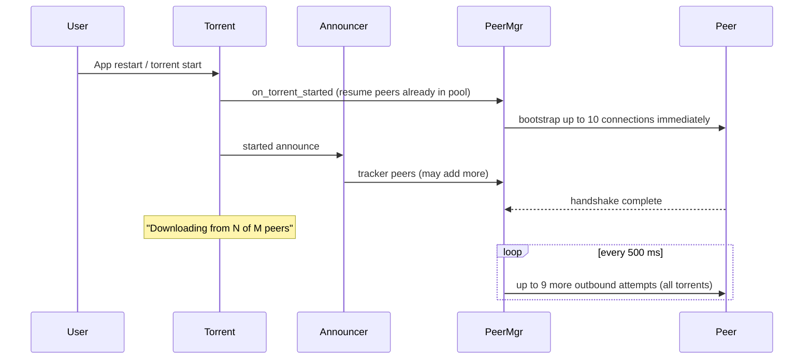

# Peer Connection Bootstrap

This document describes how Transmission establishes peer connections for newly added torrents, especially when many torrents are active and global connection limits are nearly full.

## Problem

When adding a new download while hundreds of other torrents are running, the UI can show **"Downloading from 0 of 0 peers"** for several seconds even though the tracker has returned 10–20 peers. Known peers sit in the connectable pool but no TCP/uTP connections are opened yet.

## Root Causes

### 1. Peers are queued, not connected immediately

Tracker responses call `tr_peerMgrAddPex()`, which only adds addresses to each swarm's `connectable_pool`. Outbound connections are created later by `tr_peerMgr::make_new_peer_connections()` during the 500 ms **bandwidth pulse**.

**On app restart**, resume peers are loaded during torrent init **before** the swarm is running, so the tracker hook does not run for them. Bootstrap on `on_torrent_started()` covers that case using peers already restored from the `.resume` file.

### 2. Global outbound throttle

At most **9 outbound handshakes per 500 ms pulse** (`MaxConnectionsPerPulse`) are attempted across **all** torrents. With hundreds of swarms competing, a new torrent waits its turn in a cached candidate list (up to ~2 seconds TTL).

### 3. Near-limit hard stop (fixed)

Previously, when connected peers reached **95% of the global limit**, **no** outbound connections were attempted. With a limit of 200 peers, nothing new could connect at 190+ peers—even for torrents with zero connections.

### 4. Weak bootstrap priority

Candidate scoring preferred recently started torrents, but not strongly enough when many other downloads were also active.

## Behavior After Bootstrap Improvements

Transmission now follows patterns similar to libtorrent's [`torrent_connect_boost`](https://www.libtorrent.org/reference-Settings.html):

| Mechanism | Description |
|-----------|-------------|
| **Tracker connect boost** | On the **first tracker peer list** for a swarm with **zero connected peers**, up to **10** outbound connections start **immediately** (not waiting for the next pulse). |
| **Start connect boost** | When a **downloading torrent starts** (including after app restart) with resume peers in the pool but **zero connected peers**, the same immediate bootstrap runs. |
| **Candidate cache invalidation** | Adding peers to a zero-peer swarm within 60 s of start clears the cached outbound candidate list so the next pulse rebuilds with the new addresses. |
| **Bootstrap scoring** | Swarms with **no connected peers** rank ahead of swarms that already have connections when selecting candidates. |
| **Near-limit exception** | When at the outbound cap, connections are still attempted **only for swarms with zero connected peers** (existing swarms with peers are skipped until slots free up). |

Existing behavior is unchanged for:

- **Incoming connections** (still preferred when near limits; see ticket #2609).
- **Seeding torrents** — downloading swarms still "steal" slots from finished torrents when socket limits are hit.
- **Per-torrent and global peer limits** — enforced after connections succeed.

## Connection Timeline (typical new download)

## Tuning

| Setting | Default | Effect |
|---------|---------|--------|
| `peer-limit-global` | 200 | Max connected peers session-wide |
| `peer-limit-per-torrent` | 50 | Max peers per torrent |
| Torrent priority (`high` / `normal` / `low`) | normal | Higher priority torrents win candidate scoring |

For large libraries (100+ torrents), consider:

- Raising `peer-limit-global` if your router and OS tolerate it (many users run 400–800 on libtorrent-based clients).
- Setting **high priority** on torrents you add for immediate watching.
- Ensuring the **listening port is open** — incoming peers bypass the outbound throttle entirely.

## Implementation Files

- `libtransmission/peer-mgr-connect.h` — bootstrap constants and API
- `libtransmission/peer-mgr-connect-score.inc` — candidate scoring (included from `peer-mgr.cc`)
- `libtransmission/peer-mgr-connect-candidates.inc` — candidate selection and tracker bootstrap
- `libtransmission/peer-mgr.cc` — `tr_peerMgrAddPex()` tracker boost hook, bandwidth pulse scheduling

## Related Documentation

- [Piece Download Priority](Piece-Download-Priority.md) — piece request ordering after peers connect
- [Why Are My Speeds So Slow](Why-Are-My-Speeds-So-Slow.md) — general network tuning
